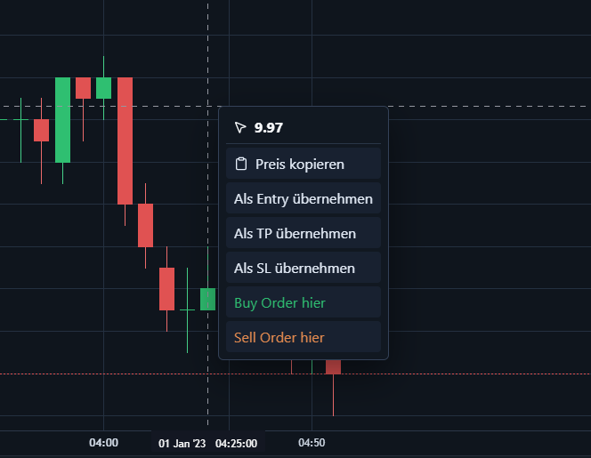
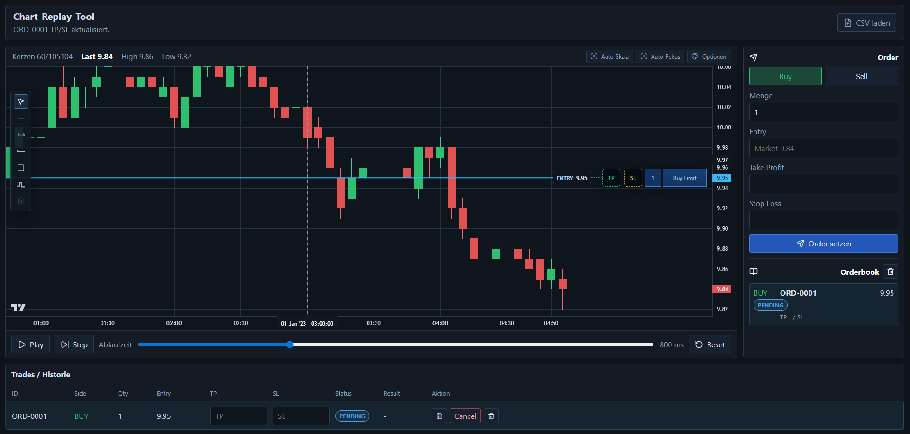
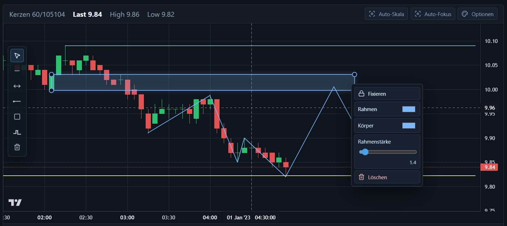
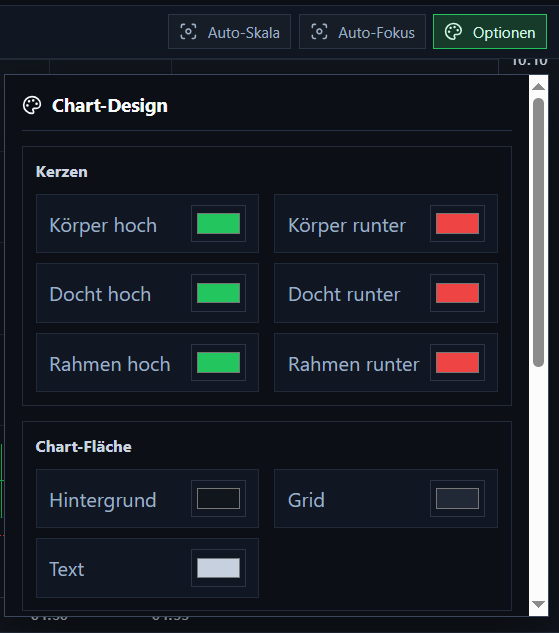

# Chart_Replay_Tool

Browser-App für Candle-Replay, Order-Simulation, Zeichenwerkzeuge und ein internes Orderbook.

Beim Start wird automatisch diese Datei geladen:

```text
chart_data/1-12_2023_5m_SOLUSDT.csv
```

## Start

```bash
npm.cmd install
npm.cmd run dev
```

URL: http://127.0.0.1:8788/

Port `8787` wird bewusst nicht benutzt.

Alternativ kann unter Windows die Datei `start.bat` ausgeführt werden.

## CSV-Format

Die vorhandene Datei nutzt diese Struktur:

```csv
timestamp_ms,symbol,timeframe,open,high,low,close,volume
1672531200000,SOLUSDT,5m,9.97,10.02,9.95,10.0,25797.23
```

Unterstützte Spaltennamen:

```csv
time,open,high,low,close,volume
2026-01-01,102,106,100,104,1200
```

Auch `date`, `datetime`, `timestamp` oder `timestamp_ms` für Zeit sowie `o,h,l,c,v` sind möglich.

## Was das Programm kann

- OHLCV-Daten aus `chart_data` automatisch laden
- CSV-Dateien manuell im Browser laden
- Kerzen als TradingView-Lightweight-Chart anzeigen
- Candle-Replay Schritt für Schritt abspielen
- Replay-Geschwindigkeit einstellen
- Chart frei verschieben und zoomen
- Auto-Skala und Auto-Fokus schalten
- Buy/Sell-Limit-Orders setzen
- automatische Order-ID vergeben
- Pending-Orders im Chart anzeigen
- Pending-Orders lokal zwischenspeichern und beim Neustart wiederherstellen
- Entry, TP und SL als Linien im Chart anzeigen
- Pending-Entry im Chart verschieben, solange die Order noch nicht aktiv ist
- TP und SL nachträglich im Chart oder in der Historie anpassen
- Schutzlogik für TP/SL: Buy/Sell kann nicht auf die falsche Seite gezogen werden
- Orderbook anzeigen und leeren
- Orders stornieren oder löschen
- Trades / Historie anzeigen
- Rechtsklick-Menü im Chart zum Preis kopieren oder Order setzen
- Design-Setup für Chartfarben, Kerzenkörper, Dochte, Hintergrund, Grid und Text
- Sprache zwischen Deutsch und Englisch umschalten
- Zeichenwerkzeuge im Chart nutzen:
  - Trendlinie
  - horizontale Linie
  - halbe horizontale Linie
  - Rechteck / Zone
  - Zig Zag
- Zeichnungen verschieben, skalieren, fixieren, löschen und lokal speichern
- Zeichnungsfarben, Linienstärke und Rahmenstärke einstellen
- Zig-Zag-Punkte nachträglich verschieben
- `Strg`-Snap für Zeichenpunkte an Kerzen-High oder Kerzen-Low

## Bilder

### Order-Erstellung und Historie



### Neues Chartfenster mit Order-Übersicht



### Zeichenwerkzeuge und Menü



### Rechtsklick Order-Menü


### Setup-Menü


