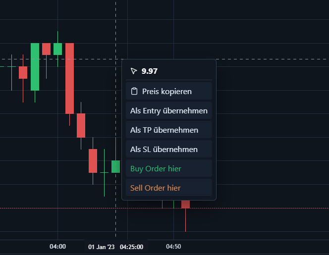
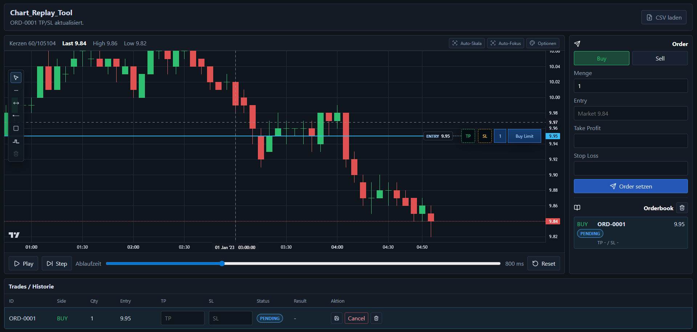
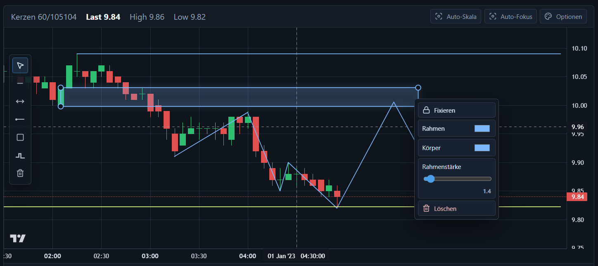
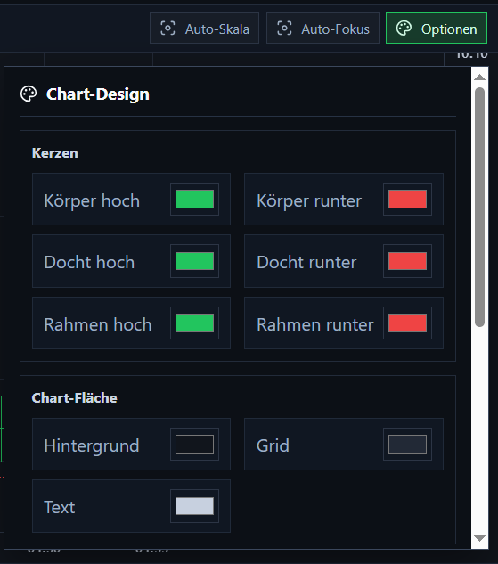
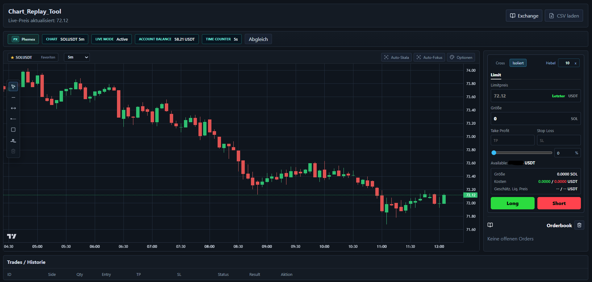

# Chart_Replay_Tool

Browser-App für Candle-Replay, Order-Simulation, Zeichenwerkzeuge, internes Orderbook, Bot-Schnittstelle und optionale Live-Anbindung an Phemex oder Binance.

Beim Start wird automatisch diese Datei geladen:

```text
chart_data/1-12_2023_5m_SOLUSDT.csv
```

## Start

```bash
npm.cmd install
npm.cmd run dev
```

URL: http://127.0.0.1:8788/

Port `8787` wird bewusst nicht benutzt. Alternativ kann unter Windows `start.bat` ausgeführt werden.

## Betriebsarten

### Replay

Im Replay-Modus arbeitet das Tool lokal mit CSV-Daten. Orders werden im internen Orderbook simuliert und nicht an eine Börse gesendet.

### Live

Im Live-Modus kann das Tool Marktdaten, Kontostand, offene Orders und Positionen über eine Börsen-API abgleichen. Aktuell sind Phemex und Binance auswählbar.

API-Daten werden lokal in `.env.local` gespeichert.

Wichtige Live-Funktionen:

- Börsen-Auswahl zwischen Phemex und Binance
- API Key / Secret lokal speichern
- Testnet / Mainnet umschalten
- Mainnet-Orders bewusst separat erlauben
- Live-Chartdaten laden
- Live-Preis in einstellbarer Abfragezeit aktualisieren
- Futures-USDT-Kontostand anzeigen
- offene Börsen-Orders und Positionen übernehmen
- eine offene Order oder Position pro Asset blockieren
- Limit- und Market-Orders senden
- Pending-Orders stornieren
- aktive Positionen schließen
- Gewinnziel und Verluststopp im Chart nachführen
- serverseitige Doppel-Order-Sperre pro Börse, Symbol und Netz
- Börsenabgleich vor jeder echten Live-Order

Geladene Exchange-Charts werden im vorhandenen CSV-Format gespeichert:

```text
chart_data/phemex_chart/
chart_data/binance_chart/
```

## CSV-Format

Die vorhandene Datei nutzt diese Struktur:

```csv
timestamp_ms,symbol,timeframe,open,high,low,close,volume
1672531200000,SOLUSDT,5m,9.97,10.02,9.95,10.0,25797.23
```

Unterstützte Spaltennamen:

```csv
time,open,high,low,close,volume
2026-01-01,102,106,100,104,1200
```

Auch `date`, `datetime`, `timestamp` oder `timestamp_ms` für Zeit sowie `o,h,l,c,v` sind möglich.

## CSV Erstellen

Über `CSV erstellen` kann eine Binance-Futures-CSV im bestehenden `chart_data`-Format erzeugt werden.

Einstellungen:

- Coin, zum Beispiel `SOL`
- Quote, zum Beispiel `USDT`
- Timeframe, zum Beispiel `1m`, `3m`, `5m`, `15m`, `30m`, `1h`, `4h`
- Startjahr
- Startmonat
- Anzahl Monate
- Testnet oder Mainnet

Zusätzlich liegt ein Builder-Script im Projekt:

```bash
python data_builder/binance_ohlcv_builder.py
```

## Was das Programm kann

- OHLCV-Daten aus `chart_data` automatisch laden
- CSV-Dateien manuell im Browser laden
- Phemex- und Binance-Chartdaten in das bestehende CSV-Format laden
- Binance-OHLCV-Daten erzeugen
- Kerzen als TradingView-Lightweight-Chart anzeigen
- Candle-Replay Schritt für Schritt abspielen
- Replay-Geschwindigkeit einstellen
- Chart frei verschieben und zoomen
- Auto-Skala und Auto-Fokus schalten
- Buy/Sell-Orders setzen
- Limit- und Market-Ordertyp wählen
- automatische Order-ID vergeben
- Pending-Orders im Chart anzeigen
- Pending-Orders lokal zwischenspeichern und beim Neustart wiederherstellen
- Entry, Gewinnziel und Verluststopp als Linien im Chart anzeigen
- Pending-Entry im Chart verschieben, solange die Order noch nicht aktiv ist
- Gewinnziel und Verluststopp nachträglich im Chart oder in der Tabelle anpassen
- Schutzlogik für Gewinnziel und Verluststopp
- Orderbook anzeigen und leeren
- Orders stornieren oder Positionen schließen
- Trades und Historie getrennt anzeigen
- Trade-Historie gezielt löschen
- TP/SL/PNL-Übersicht anzeigen
- PNL-Verlauf als Kurve anzeigen
- Brutto-PNL, Netto-PNL und Broker-Gebühren anzeigen
- Broker-Gebühr im Exchange-Menü einstellen
- Rechtsklick-Menü im Chart zum Preis kopieren
- Rechtsklick-Menü im Replay-Modus mit direktem `Buy Order hier` / `Sell Order hier`
- Kontextmenüs, Optionen und Dropdowns schließen beim Klick außerhalb ihres eigenen Fensters
- Design-Setup für Chartfarben, Kerzenkörper, Dochte, Hintergrund, Gitter und Text
- Sprache zwischen Deutsch und Englisch umschalten
- Zeichenwerkzeuge im Chart nutzen:
  - Trendlinie
  - horizontale Linie
  - halbe horizontale Linie
  - Rechteck / Zone
  - Zig Zag
- Zeichnungen verschieben, skalieren, fixieren, löschen und lokal speichern
- Zeichnungsfarben, Linienstärke und Rahmenstärke einstellen
- Zig-Zag-Punkte nachträglich verschieben
- `Strg`-Snap für Zeichenpunkte an Kerzen-High oder Kerzen-Low

## Exchange-Setup

Der Exchange-Bereich befindet sich im Optionen-Menü unter `Börse`.

Wichtige Einstellungen:

- Börse: Phemex oder Binance
- API Key und API Secret
- Testnet oder Mainnet
- Mainnet-Orders erlauben
- Symbol
- Timeframe
- Kerzenanzahl
- Preisabruf in Sekunden
- Broker-Gebühr in Prozent
- Replay oder Live

Die Symbol-Auswahl nutzt `coin_liste.txt`. Favoriten werden im Browser lokal gespeichert und im Live-Modus als Schnellzugriff angezeigt.

## Tradingbot-Schnittstelle

Im Optionen-Menü gibt es den Bereich `Bot`. Darüber kann ein lokaler Python-Bot eingebunden werden.

Standard-URL:

```text
http://127.0.0.1:8790/tick
```

Mitgelieferte Bot-Scripte:

```text
bot_bridge/long_bot.py
bot_bridge/short_bot.py
bot_bridge/spot_grid_bot.py
```

Der Bot kann im Bot-Setup mit `Start`, `Pause`, `Stop` und `Reload` gesteuert werden. Es wird nur ein Projekt-Bot-Prozess verwaltet.

Der Browser sendet nicht direkt an den Bot. Die App nutzt den lokalen Backend-Proxy:

```text
POST /api/bot-tick
```

Der Proxy akzeptiert nur lokale Bot-URLs mit `localhost` oder `127.0.0.1`.

### Bot-Modi

- `Paper Trading`: Bot darf interne Tool-Orders im Orderbook erzeugen.
- `Live Trading`: Bot-Signale bedienen die Live-Oberfläche. Das Tool prüft Menge, Gewinnziel, Verluststopp, Live-Freigabe und Börsenstatus und sendet erst danach die echte Order.

Im Live-Modus nutzt der Bot die Einstellungen aus dem Live-Orderpanel:

- Ordertyp
- Größe
- Limitpreis
- Gewinnziel
- Verluststopp
- Testnet / Mainnet
- Börsen-Freigaben

Wenn Größe, Gewinnziel oder Verluststopp fehlen, wird das Signal blockiert.

### Input an den Bot

Bei Replay-Step und Live-Preisabruf sendet das Tool einen Tick an den Bot:

```json
{
  "mode": "replay",
  "botMode": "signals",
  "exchange": "phemex",
  "symbol": "SOLUSDT",
  "timeframe": "5m",
  "livePrice": null,
  "candle": {
    "time": 1672531200,
    "open": 9.97,
    "high": 10.02,
    "low": 9.95,
    "close": 10.0,
    "volume": 25797.23
  },
  "openOrders": [],
  "balance": 58.21,
  "liveOrdersEnabled": false
}
```

### Output vom Bot

Signal ohne Order:

```json
{
  "ok": true,
  "action": "signal_buy",
  "note": "Example signal"
}
```

Keine Aktion:

```json
{
  "ok": true,
  "action": "hold"
}
```

Interne Simulation-Order:

```json
{
  "ok": true,
  "action": "place_order",
  "side": "buy",
  "entry": 62.05,
  "quantity": 1,
  "takeProfit": 63.2,
  "stopLoss": 61.4
}
```

Alternative Feldnamen werden teilweise erkannt:

```text
entry oder price
quantity oder qty oder size
takeProfit oder take_profit oder tp
stopLoss oder stop_loss oder sl
```

## Sicherheit

- `.env.local` enthält lokale API Keys.
- Mainnet-Orders sind zusätzlich gesperrt, bis sie in den Exchange-Einstellungen ausdrücklich erlaubt werden.
- Echte Live-Orders benötigen die Live-Order-Freigabe.
- Vor einer echten Live-Order prüft das Backend offene Orders und Positionen auf der Börse.
- Pro Börse, Symbol und Netz wird eine neue Live-Order serverseitig kurzzeitig blockiert, wenn gerade eine Order gesendet wurde.
- Im Replay-Modus werden keine echten Börsen-Orders gesendet.
- Die Bot-Schnittstelle akzeptiert nur lokale Bot-URLs.
- Generierte Chart-CSV-Dateien in `chart_data/phemex_chart` und `chart_data/binance_chart` sind lokale Laufzeitdaten.

## Bilder

### Order-Erstellung und Historie



### Neues Chartfenster mit Order-Übersicht



### Zeichenwerkzeuge und Menü



### Rechtsklick Order-Menü


### Setup-Menü



### Exchange-Oberfläche


